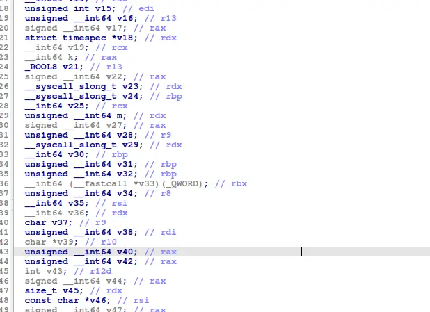
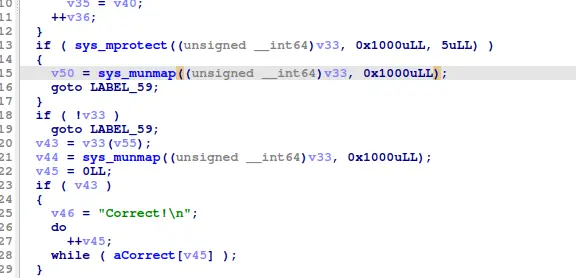
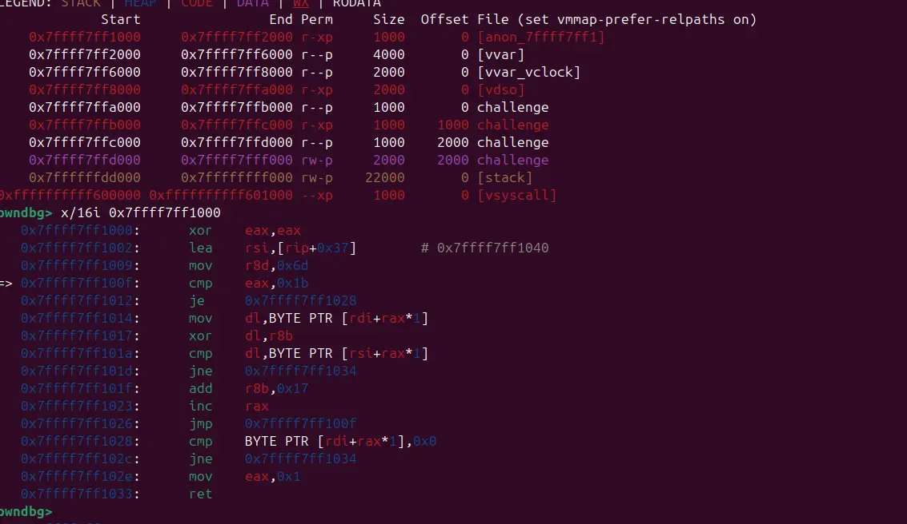
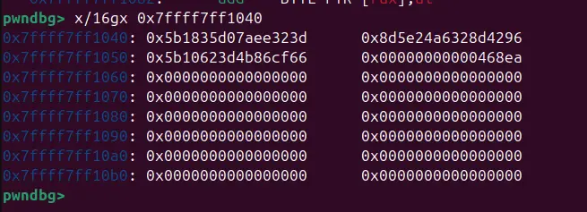
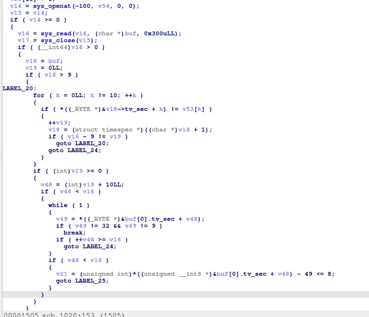
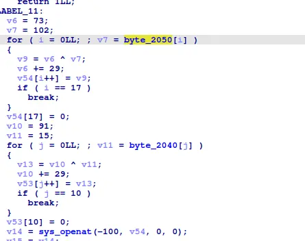
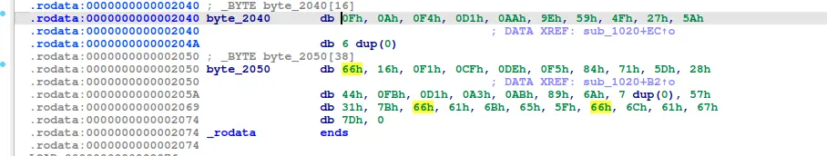
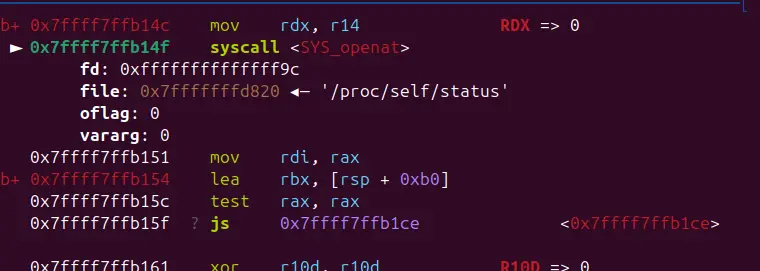
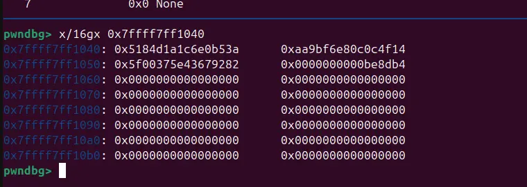

Vì bài này không có server nên là flag nó sẽ nằm trong cái binary luôn

nhìn qua pseudo code trong gdb thì không thấy cái phần nào là checkflag hết, nma có 1 biến v33 được tạo ra thành vùng executable bằng sys_munmap, rồi gọi vào, nên khả năng cao là function check flag

Khi ta kiểm tra, ta thấy input được so sánh với 1 xâu encrypted với encryption key tăng 0x17 sau mỗi lần xor

Nhưng khi ta cố gắng khôi phục flag, xâu ta nhận được lại không viết tay được

debug tiếp, ta thấy process open file và xử lý mà không tương tác với giao diện

nhìn lên phía trên ta có thể thấy tên file đã được xor

khi debug trong dbg, ta thấy process open file /pro/self/status, khả năng cao là để check xem file có đang bị trace không

Dùng gdb jump qua đoạn đó, vào lại function check flag, ta thấy một đoạn mã khác

Thử giải mã lại

Flag: W1{th1s_1s_fin4l_flaggg!!!}